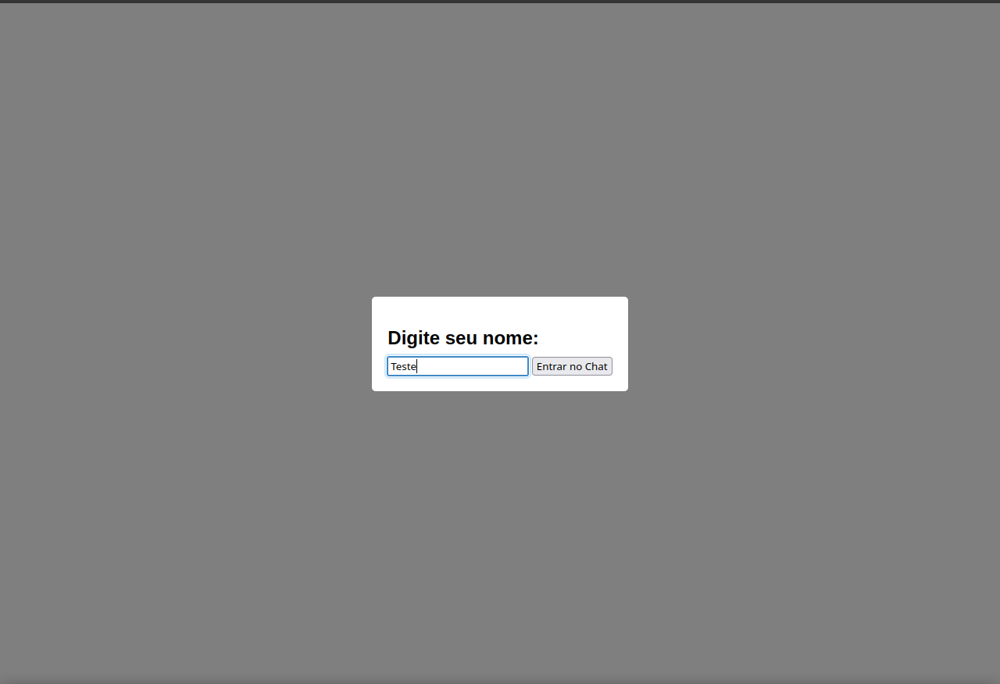
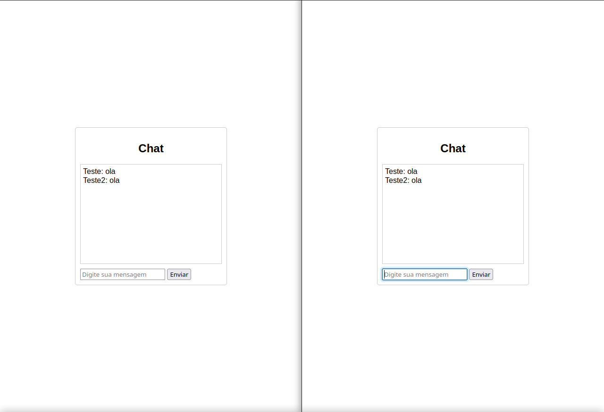

# CHAT REAL TIME :computer:

repositorio pratico de web sockets em java num projeto de chat em tempo real.
Projeto desenvolvido com base no repositorio e Video do Youtube de [DanielTM999](https://github.com/DanielTM999/chat_realtime_springboot)

## Tecnologias utilizadas
- Java 17
- Spring WebSocket
- Maven
- Javascript
- HTML e CSS

## Como executar o projeto
1. Clonar o projeto
```bash 
  git clone https://github.com/j0n4t45d3v/chatRealTime.git
```
2. Entrar na pasta do projeto
```bash 
  cd chatRealTime
```
3. Buildar o projeto
```bash 
  ./mvnw clean install
```
4. Executar o projeto
```bash 
  java -jar target/chatRealTime-0.0.1-SNAPSHOT.jar
```
5. Acessar o chat
```bash 
  http://localhost:8080
```

## Telas do projeto

### Tela de Entrada

### Tela do Chat


## Autor
- Jonatas De Lima
